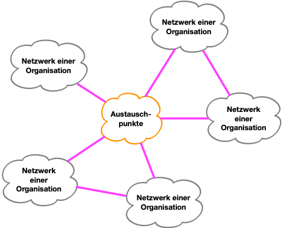
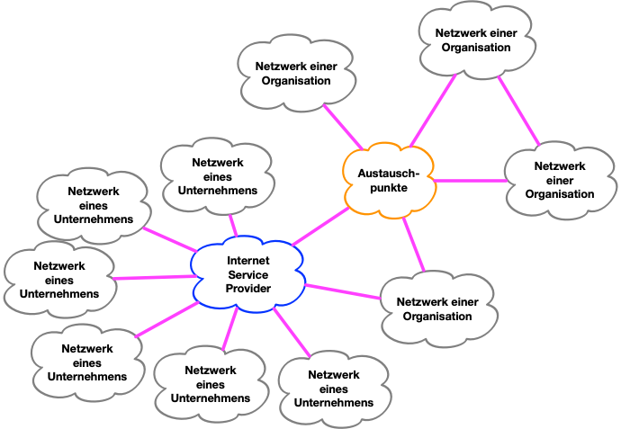
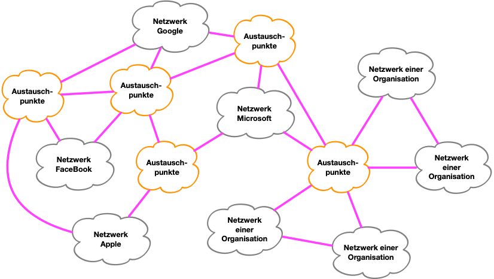

# Raus der aus der Cloud - viel Geld sparen
## Eigene Infrastruktur ist nicht so schwer
Seit es das Internet gibt haben Organisationen ganz unterschiedlicher Größe wie Unternehmen, Universitäten und private Betreiber eigene Infrastruktur für die Teilnahme am Internet und zum Anbieten von Diensten im Internet betrieben. Das ist der Normalzustand.

> Der Begriff "Cloud" ist in erster Linie Marketing und ein mentales Bild

## Ursprüngliches Design des Internet
Das Internet war und ist als Netzwerk der Netzwerke - das bedeutet *Internet* - gedacht. Private Netzwerke verbinden sich direkt und über Austauschpunkte miteinander. Das Ziel ist, daß jeder mit jedem kommunizieren kann. Die generelle Struktur sieht daher wie im folgenden Bild aus:

<figure>
  
</figure>

Austauschpunkte ermöglichen Verbindungen zwischen Teilnehmern, die sich nicht direkt über fest installierte Leitungen verbinden möchten. Stattdessen verbindet man sich mit einem oder mehreren der Austauschpunkte. Einige der größeren Austauschpunkte in Europa sind:

| IXP Name         | Betreiber                             | Land           | Anzahl der Verbindungen |
| ---------------- | ------------------------------------- | -------------- | ----------------------- |
| AMS-IX           | AMS-IX (gemeinnützig)                 | Niederlande    | 900+                    |
| DE-CIX Frankfurt | DE-CIX Management GmbH (gemeinnützig) | Deutschland    | 1100+                   |
| LINX (London)    | LINX (gemeinnützig)                   | Großbritannien | 900+                    |
| Netnod           | Netnod (gemeinnützig)                 | Schweden       | 269                     |
| France-IX        | France-IX (gemeinnützig)              | Frankreich     | 540                     |
| MSK-IX           | MSK-IX (gemeinnützig)                 | Russland       | 556                     |
| MIX Mailand      | MIX (gemeinnützig)                    | Italien        | 280                     |

### Internet Service Provider für kleinere Organisationen
Da der Anschluß des eigenen Netzwerks direkt an einen Austauschpunkt nicht für jede Organisation fachlich und wegen der Kosten, aber auch der von den Austauschpunkten aufgestellten Regeln, möglich ist, gibt es Internet Service Provider. Diese bieten ihren Kunden den Anschluß an das Internet an und übernehmen diverse Aufgaben, die dafür erforderlich sind. Damit sieht die Struktur des Internet nun so aus:

<figure>
  
</figure>

> Stephan Schwab hat in den 1990iger Jahren in Dortmund und im Raum Heidelberg einen der frühen Internet Service Provider in Deutschland betrieben. Das deutsche Internet bestand damals primär aus den Universitäten und einigen privaten Initiativen aus denen teilweise ISPs hervorgingen. Unter dem Namen VentureNET hat Stephan Schwab auch das erste Verzeichnis kommerzieller Webseiten in Deutschland aufgebaut. Es war vergleichbar mit dem Angebot von Yahoo! in USA.

## Die Geburt der "Cloud"
Große Softwareunternehmen und Plattformbetreiber haben verteilte und große Rechenzentren, die typischerweise an mehrere Austauschpunkte angebunden sind. Ursprunglich stellten diese Unternehmen Server und andere Infrastruktur in vorhandenen Rechenzentren größerer Internet Service Provider auf. Nach einiger Zeit wurde es kostengünstiger eigene Rechenzentren zu bauen und dann von dort weitere Dienste anzubieten. **Die "Cloud" war geboren.** Gleichzeitig ergab sich eine enorme zusätzliche Einkommensquelle für diese Unternehmen.

Damit veränderte sich die Struktur des Internet nun zu einem Netzwerk zwischen Rechenzentren statt zwischen vielen kleinen und großen Organisationen:

<figure>
  
</figure>

## Virtualisierung
Das Internet der Rechenzentren macht aber noch nicht die Cloud aus - es ist nur ein Teil davon. Es sind immer noch physische Server, die mit Kabeln einzeln an Netzwerkkomponenten angeschlossen sind - und die auch regelmäßige Wartung und Austausch benötigen.

Mit dem Aufkommen von Virtualisierungstechniken war es möglich innerhalb von Minuten oder Sekunden flexibel virtuelle Server auf derselben Hardware zu erzeugen und diese an unterschiedliche Kunden zu vermieten. **Virtualisierung ist die andere wesentliche Komponente der Cloud.**

## Es fällt die Cloud aus und Sie können nichts tun
Große Plattformbetreiber für Cloud-Dienste haben diesselben Probleme wie alle anderen auch. Sie sind ebenso von Fehlern und Attacken wie alle anderen Teilnehmer im Internet betroffen. Natürlich ist es richtig, daß diese Unternehmen aufgrund der eigenen Größe viele Spezialisten unter ihren Mitarbeitern haben und daher bei Problemen möglicherweise besser reagieren können.

Aber dafür sind von Problemen sehr, sehr viele Kunden betroffen. Wenn Ihr Dienst auf der Infrastruktur eines Cloud-Betreibers basiert und diese ausfällt, dann können Sie als Kunde rein gar nichts tun. Zusammen mit allen anderen Kunden des Cloud-Betreibers sind auch Sie nicht erreichbar und das bedeutet, daß Sie Umsatz verlieren oder Ihre eigenen Kunden nicht mehr arbeiten können. Das Problem wird sehr schnell sehr groß und betrifft sehr viele Menschen. Sie als Anbieter können nur warten bis die Mitarbeiter des Cloud-Betreibers das Problem gelöst haben.

**Cloud bedeutet neue Abhängigkeiten zu haben.**
